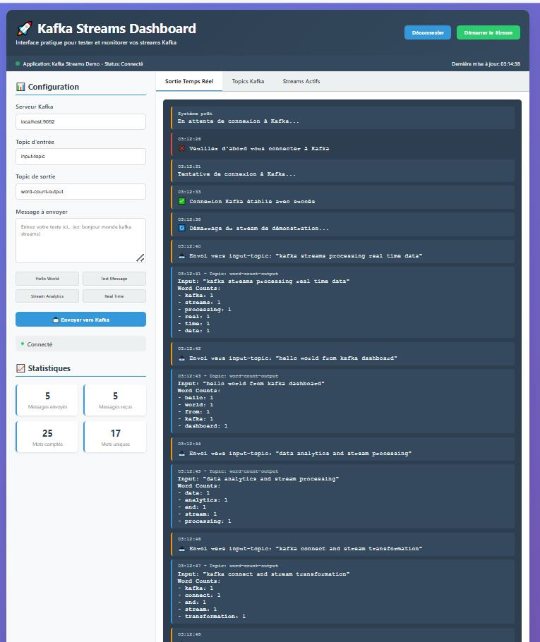
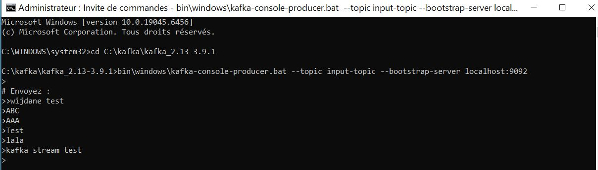
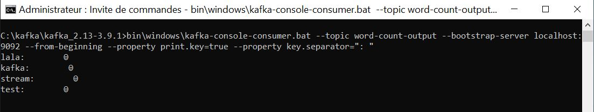

# ⚡ Kafka Spring Stream Demo

Une application complète en Spring Boot utilisant **Kafka Streams** pour le traitement de données en temps réel avec visualisation instantanée des résultats.


---

## 🚀 Fonctionnalités

- Streaming temps réel avec Kafka Streams
- Word Count (exemple démo)
- API REST de publication / lecture
- Interface Web temps réel
- Monitoring pipelines Kafka
- Architecture modulaire
- Service analytique en streaming

---

## 🛠️ Technologies utilisées

- Java 17
- Spring Boot 3.2
- Kafka Streams API
- Apache Kafka
- Maven
- WebSocket (optionnel)
- Thymeleaf / React (selon UI)

---

## 📁 Structure du Projet

```text
kafka-spring-stream-demo/
│
├── src/main/java/com/example/kafka/
│ ├── analytics/
│ │ └── KafkaStreamsAnalytics.java # Service Kafka Streams
│ ├── consumer/
│ │ └── KafkaConsumerService.java # Service consommateur
│ ├── controller/
│ │ └── AnalyticsController.java # Contrôleur API REST
│ ├── supplier/
│ │ └── KafkaSupplierService.java # Service producteur
│ ├── web/
│ │ └── AnalyticsController.java # Contrôleur Web
│ └── KafkaDemoApplication.java # Classe principale
│
├── src/main/resources/
│ ├── static/
│ │ └── index.html # Interface web
│ ├── templates/
│ │ └── dashboard.html # Template dashboard
│ └── application.properties # Configuration
│
├── documentation/images/ # Captures d'écran de test
│ ├── PAGE_WEB_Test_STREAM.JPG
│ ├── T_Input.JPG
│ ├── T_output.JPG
│ └── T_output_Count.JPG
│
├── .vscode/
│ └── settings.json # Configuration VS Code
│
├── pom.xml # Configuration Maven
├── README.md # Documentation
├── Licence # Licence MIT
└── .gitignore # Fichiers ignorés par Git
````

---

## 🏃 Installation et exécution

### Prérequis

* Java 17+
* Maven
* Apache Kafka installé

### 1️⃣ Cloner le projet

```bash
git clone https://github.com/Wijdaneh/kafka-spring-stream-demo.git
cd kafka-spring-stream-demo
```

### 2️⃣ Démarrer Kafka

```bash
# Démarrer Zookeeper
bin/zookeeper-server-start.sh config/zookeeper.properties

# Démarrer Kafka
bin/kafka-server-start.sh config/server.properties
```

Créer les topics :

```bash
bin/kafka-topics.sh --create --topic input-topic --bootstrap-server localhost:9092
bin/kafka-topics.sh --create --topic output-topic --bootstrap-server localhost:9092
```

### 3️⃣ Lancer l'application

```bash
mvn clean spring-boot:run
```

Application accessible sur :
[http://localhost:8080](http://localhost:8080)

---

## 🔧 Utilisation

### Envoyer un message au flux Kafka

```bash
curl -X POST "http://localhost:8080/api/publish" \
     -H "Content-Type: application/json" \
     -d '{"message": "hello world from streaming app"}'
```

### Récupérer les résultats du streaming

```bash
curl -X GET "http://localhost:8080/api/results"
```

Exemple de réponse JSON :

```json
{
  "hello": 1,
  "world": 1,
  "streaming": 1,
  "app": 1
}
```

## 🧪 Tests et Validation

### Résultats des tests Kafka Streams

| Test | Description | Résultat |
|------|-------------|----------|
| **Interface Web** | Dashboard de monitoring |  |
| **Input Topic** | Envoi de messages vers input-topic |  |
| **Output Topic** | Réception des messages bruts |  |
| **Word Count** | Résultats du comptage de mots |  |
---

## 🔄 Flux de traitement Kafka

```text
1. Client → POST /publish (message)
2. Application → push dans input-topic
3. Kafka Streams → Word Count
4. Résultats envoyés vers output-topic
5. Application → expose /results en REST ou WebSocket
6. Interface web → affichage en temps réel
```

---

## 📊 Monitoring (optionnel)

| Outil     | URL / Commande                                       |
| --------- | ---------------------------------------------------- |
| Kafka UI  | [http://localhost:8080/ui](http://localhost:8080/ui) |
| Kafka CLI | bin/kafka-console-consumer.sh                        |
| Conduktor | Externe                                              |
| ksqlDB    | Optionnel                                            |

---

## 🤝 Contribution

```text
Fork le projet
Créer une branche feature/*
Commit + Push
Pull Request
```

---

## 📝 Licence

Ce projet est sous licence MIT.

---

## 👨‍💻 Auteur

**Wijdane**
GitHub : [https://github.com/Wijdaneh](https://github.com/Wijdaneh)

---

## 🔮 Améliorations futures

* Pipeline multi-topic
* Agrégations temporelles (windowing)
* Détection d’événements anormaux
* Notifications en temps réel
* Intégration Redis / ElasticSearch
* Dashboard React pour live analytics
* Exposition métriques Prometheus + Grafana

---

⭐ Si ce projet vous aide, pensez à lui mettre une étoile sur GitHub 🙂

